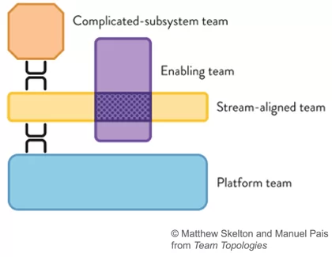
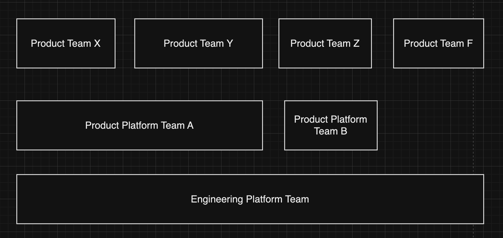

# Platform Team

Платформенная команда, организована вокруг разработки и поддержки платформ, предоставляющих услуги другим командам.

## Источники задач

- Заказ функциональности от продуктовых команд;
- Функциональность, придуманная платформенной командой самостоятельно, но на основе проблем, которые испытывают продуктовые команды;
- Технический долг, который не может решить продуктовая команда;
- Поддержка внедрения новых мировых стандартов и/или обновление текущих инструментов/библиотек до LTS-версий.

## Характеристики

- Ориентация на потребность коллег;
- Высокий уровень технических компетенций;
- Богатый опыт;
- Высокий уровень эмпатии и открытости.

## Эффективность

- Cокращение time-to-market (TTM);
- Cокращение cтоимости владения (TCO);
- Признание продуктовых команд;
- Cравнительные характеристики зрелости IT процессов с лидерами рынка на основе метрик индустрии, например DORА. 

## Жизненный цикл
 - Bottom-Up;
 - Top-bottom.

Метод **Bottom-Up** способствует естественному увеличению числа членов команды разработчиков. Когда команда достигает определенного размера, несколько её участников выделяются на выполнение общих задач. С продолжением роста команды количество людей, работающих над общими компонентами и кодом, возрастает, и спустя время у вас образуется платформенная команда, функционирующая параллельно с несколькими продуктовыми командами.

Метод **Top-Down** характерен для компаний, где платформенные команды создаются после того, как разные бизнесы уже сформировали свои подходы к IT. Проблемы возникают, когда:

- Требуется интеграция бизнесов с разными IT-возможностями для создания новой ценности для клиентов.
- Необходим расчет стоимости владения множеством IT-систем.

Тогда руководство инициирует унификацию подходов к IT, создавая платформенные команды.

## Виды

- Продуктовая платформа 
- Инженерная платформа

### Продуктовая платформа 

Продуктовая платформа — это набор команд, обеспечивающих другие команды сервисами общего назначения или общей функциональности для реализации их продуктовых задач. Например, это могут быть SaaS-сервисы авторизации, поиска, коммуникаций, проведения A/B-тестов, аналитический событий ... 
 
### Инженерная платформа 

 Инженерная платформа — это набор команд, обеспечивающих других инженеров каждого стека разработки набором общих инструментов, подходов, практик, соглашений по решению однотипных/однородных задач для централизации общих методик и минимизации хаоса при их решении. 

### Примеры общих задач команды инженерной платформы

- Проведение встреч гильдии: techtalk, sync, демо и других форматов;
- Сбор потребностей гильдии от её участников и формирование бэклога задач для команды разработки, обслуживающей задачи гильдии;
- Точка входа для devrel с целью выступлений на конференциях;
- Помощь в онбординге новых членов гильдии в стек разработки;
- Разработка инструментов разработки на стеке гильдии;
- Актуализация документации гильдии: инструментов, онбординга и других материалов;
- Проведение технических собеседований новых членов гильдии (если требуется помощь другим командам);
- Потенциальный десант, который может помочь продуктовой команде выполнить задачи, если возникают проблемы с соблюдением сроков.

## Визуализация 

## Литература
 - [Team Topologies](https://teamtopologies.com/) 
 - [Платформенные команды — что это такое и зачем они нужны](https://tellmeabout.tech/%D0%BF%D0%BB%D0%B0%D1%82%D1%84%D0%BE%D1%80%D0%BC%D0%B5%D0%BD%D0%BD%D1%8B%D0%B5-%D0%BA%D0%BE%D0%BC%D0%B0%D0%BD%D0%B4%D1%8B-%D1%87%D1%82%D0%BE-%D1%8D%D1%82%D0%BE-%D1%82%D0%B0%D0%BA%D0%BE%D0%B5-%D0%B8-%D0%B7%D0%B0%D1%87%D0%B5%D0%BC-%D0%BE%D0%BD%D0%B8-%D0%BD%D1%83%D0%B6%D0%BD%D1%8B-d4c978115152)
